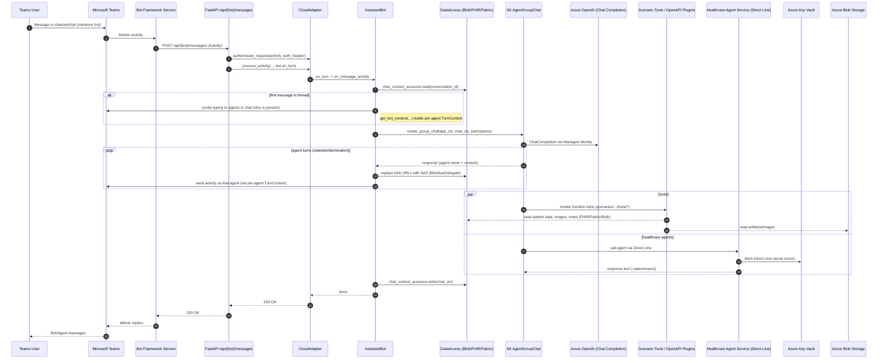
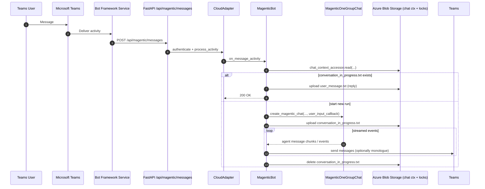
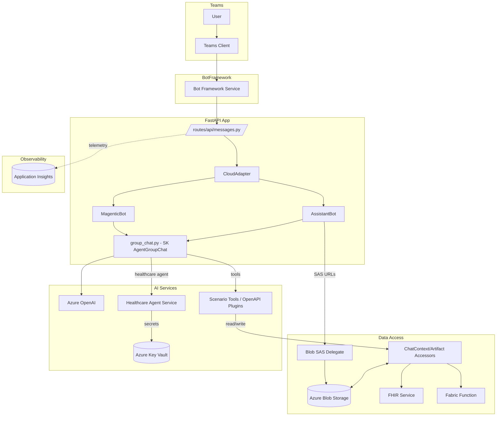

# Teams-to-Orchestrator Flow

This diagram set shows how a Microsoft Teams message flows through the bot entrypoint, orchestration logic, agents/tools, and data services in this repo.

- Entry: Teams message hits `/api/{bot}/messages` via Bot Framework Service.
- Assistant path: Semantic Kernel GroupChat orchestrates agents (from `scenarios/*/config/agents.yaml`).
- Magentic path: Experimental MagenticOne stream uses blob-based gating for user input.

## Sequence: AssistantBot (default orchestrator)

Key code:

- `src/routes/api/messages.py` (FastAPI route + CloudAdapter auth/dispatch)
- `src/bots/assistant_bot.py` (message handling, group chat invoke, SAS URL swap)
- `src/group_chat.py` (SK AgentGroupChat creation, selection/termination strategies)
- `src/data_models/*` (chat context/artifacts, FHIR/Fabric access, Blob SAS)
- `src/healthcare_agents/*` (Healthcare Agent via Direct Line + Key Vault)

## Sequence: MagenticBot (experimental)

Key code:

- `src/bots/magentic_bot.py` (blob-gated user input flow, streaming)

## Component view

Notes:

- Authentication: CloudAdapter uses `ConfigurationBotFrameworkAuthentication` with the specific bot’s App ID from environment (`BOT_IDS`) set in `DefaultConfig`.
- AOAI calls use Managed Identity via `AppContext.cognitive_services_token_provider`.
- Clinical notes can come from FHIR or Fabric based on `CLINICAL_NOTES_SOURCE` env.
- Images/artifacts live in Blob; SAS URLs are generated at send time to safely expose links in Teams.

## Where this is defined in code

- App bootstrap: `src/app.py` wires adapters and bots, mounts routes, and serves static UI.
- Agent config: `src/scenarios/<scenario>/config/agents.yaml` (facilitator, tools, descriptions).
- Env-driven wiring: `src/config.py` (`load_agent_config`, App Insights, logging).

## How to read this

Start at Teams -> Bot Framework -> `/api/{bot}/messages` route -> CloudAdapter -> Bot handler -> Group chat -> Tools/services -> back to Teams.

If you need a PNG for slides, you can paste the Mermaid blocks into a Mermaid renderer (e.g., VS Code Mermaid preview or mermaid.live) and export.
